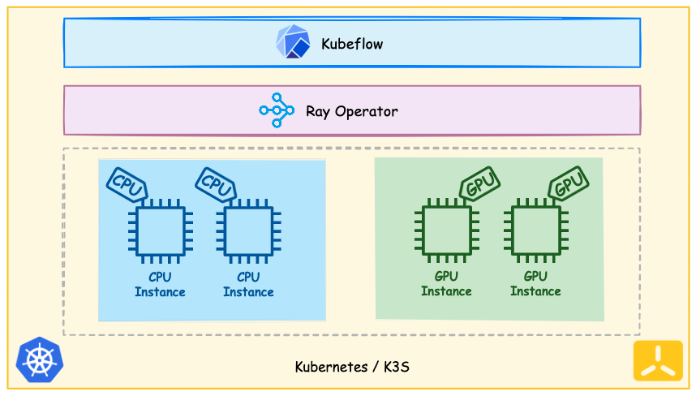

# Cost Effective ML
Building a Hybrid Kubernetes Cluster for Scalable and Cost-Effective ML Training with Ray and Kubeflow

## Building the hybrid Kubernetes Cluster


## ToDo:
1. Create two nodes and add them in cluster
2. Enable dashboard
3. Add nodes in separate node groups
4. Install kubeflow pipelines
5. Run sample tasks in separate node groups (taints and tolerations)
6. Install Ray and run ray tasks from Kubeflow
7. Enable Ray dashboard
8. Do the same with GPU nodes

## Prerequisites
These tools must be installed in the nodes before starting:
* Git
* Helm3
* Kustomize

## How to setup K3S master node

- Install K3S
```
curl -sfL https://get.k3s.io | INSTALL_K3S_VERSION=v1.25.8+k3s1 sh -
```
*Run this command to chown kubectl to use without sudo
```
sudo chown $USER /etc/rancher/k3s/k3s.yaml
```
- Install helm
```
curl -fsSL -o get_helm.sh https://raw.githubusercontent.com/helm/helm/master/scripts/get-helm-3 \
   && chmod 700 get_helm.sh \
   && ./get_helm.sh

```
- Install kustomize
```
curl -s "https://raw.githubusercontent.com/kubernetes-sigs/kustomize/master/hack/install_kustomize.sh"  | bash
sudo mv kustomize /bin/
```

- Install NVIDIA GPU Operator 

It allows cluster to have access to GPUs on nodes. It installs the neccessary tools to have access to GPU.

More on [NVIDIA-GPU-OPERATOR](https://docs.nvidia.com/datacenter/cloud-native/gpu-operator/latest/overview.html)

```
sudo helm repo add nvidia https://helm.ngc.nvidia.com/nvidia \
   && sudo helm repo update

sudo helm install --wait --generate-name \
     -n gpu-operator --create-namespace \
      nvidia/gpu-operator \
      --set driver.enabled=false \
      --set toolkit.enabled=false \
      --kubeconfig /etc/rancher/k3s/k3s.yaml
```
*Note: Wait for cluster resources to be utilized

- Install NVIDA K8S Device pulgin
```
sudo helm repo add nvdp https://nvidia.github.io/k8s-device-plugin
  sudo helm repo update
  sudo helm upgrade -i nvdp nvdp/nvidia-device-plugin \
  --namespace nvidia-device-plugin \
  --create-namespace \
  --version 0.14.0 \
  --kubeconfig /etc/rancher/k3s/k3s.yaml
```

*Restart K3S if gpus do not show as allocatable resources on node.
```sh
sudo systemctl restart k3s
```
## K3S nodes setup

Install Nvidia container runtime

```bash
distribution=$(. /etc/os-release;echo $ID$VERSION_ID) \
    && curl -s -L https://nvidia.github.io/libnvidia-container/gpgkey | sudo apt-key add - \
    && curl -s -L https://nvidia.github.io/libnvidia-container/$distribution/libnvidia-container.list | sudo tee /etc/apt/sources.list.d/nvidia-container-toolkit.list

sudo apt-get update \
    && sudo apt-get install -y nvidia-container-toolkit
```

*Note: You may need to wait a couple minutes while nvidia driver are being installed. You can check by running 
```sh
nvidia-smi
```
on node terminal which shows information about gpu.

Installing K3S agent
```sh
export K3S_NODE_TOKEN=(sudo cat /var/lib/rancher/k3s/server/node-token on master node )
export SERVER_IP=(Public/Private IP of master node)
curl -sfL https://get.k3s.io | INSTALL_K3S_VERSION=v1.25.8+k3s1 K3S_URL=https://${SERVER_IP}:6443 K3S_TOKEN=${K3S_NODE_TOKEN} sh -
```

*Restart K3S-agent 
```sh
sudo systemctl restart k3s-agent
```
    
## Usage/Examples

You can play around with GPUs by using Jupyter Notebook.

Install Kubeflow
```sh
git clone https://github.com/data-max-hq/manifests.git
cd manifests/
while ! kustomize build example | awk '!/well-defined/' | sudo k3s kubectl apply -f -; do echo "Retrying to apply resources"; sleep 10; done
```
*You may need to wait for a couple of retries as resources are being provisioned.

After Kubeflow is properly installed:
```sh
kubectl port-forward svc/istio-ingressgateway -n istio-system 8080:80 --address='0.0.0.0'
```

Create a Jupyter Notebook on Kubeflow Dashboard with specific resources with number of GPUs and set vendor to NVIDIA

Connect to Jupyter Notebook and [here](https://docs.ray.io/en/latest/ray-air/examples/convert_existing_tf_code_to_ray_air.html) you can find an example notebook which make use of gpu.


## Troubleshooting
* Configure private registries in k3s: https://docs.k3s.io/installation/private-registry
  * https://breadnet.co.uk/using-google-artifact-registry-with-k3s/
* Restart k3s and k3s-agent: https://docs.k3s.io/upgrades/manual#restarting-k3s
* Restart k3s and k3s-agent if command ```kubectl describe node *gpu-node*``` does not show nvidia.com/gpu resource


## Links 
* https://cloud.google.com/blog/products/ai-machine-learning/build-a-ml-platform-with-kubeflow-and-ray-on-gke
* https://github.com/ray-project/kuberay
* https://docs.ray.io/en/latest/cluster/kubernetes/examples/gpu-training-example.html#kuberay-gpu-training-example
* https://ray-project.github.io/kuberay/deploy/helm/
* https://docs.ray.io/en/latest/ray-air/examples/convert_existing_tf_code_to_ray_air.html


Made with ❤️ by [Data-Max.io](https://www.data-max.io/).
