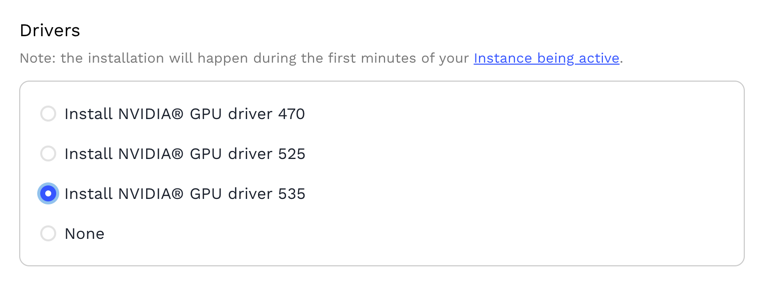

# Cost Effective ML
Building a Hybrid Kubernetes Cluster for Scalable and Cost-Effective ML Training with Ray and Kubeflow

## Building the hybrid Kubernetes Cluster


## ToDo:
1. Create two nodes and add them in cluster
2. Enable dashboard
3. Add nodes in separate node groups
4. Install kubeflow pipelines
5. Run sample tasks in separate node groups (taints and tolerations)
6. Install Ray and run ray tasks from Kubeflow
7. Enable Ray dashboard
8. Do the same with GPU nodes

## Prerequisites
These tools must be installed in the nodes before starting:
* Git
* Helm3
* Kustomize

## Setup Master Node

1. Install K3S [here](k3s/install.sh)
2. Run the command to install cluster requirements to work with GPU
  ```
  make install-helm && make install-gpu-req && make kubeflow-dashboard
  ```
  If you want to run commands manually

  ```
  curl -fsSL -o get_helm.sh https://raw.githubusercontent.com/helm/helm/master/scripts/get-helm-3 &&chmod 700 get_helm.sh && ./get_helm.sh
  sudo helm repo add nvdp https://nvidia.github.io/k8s-device-plugin
  sudo helm repo update
  sudo helm upgrade -i nvdp nvdp/nvidia-device-plugin --namespace nvidia-device-plugin --create-namespace --version 0.14.0 --kubeconfig /etc/rancher/k3s/k3s.yaml
  sudo helm repo add nvgfd https://nvidia.github.io/gpu-feature-discovery
  sudo helm repo update
  sudo helm upgrade -i nvgfd nvgfd/gpu-feature-discovery --version 0.8.0 --namespace gpu-feature-discovery --create-namespace --kubeconfig /etc/rancher/k3s/k3s.yaml
  ```
  You need the NVIDIA Device Plugin and NVIDIA GPU Discovery Feature in order to use nvidia.com/gpu tag.
3. Create a Notebook on Kubeflow Dashboard
4. You can specify the pod specs including the number of GPUs you want your notebook to run. 


## Setup Node with GPU on GenesisCloud

1. You need to enable the option "Install NVIDIA GPU Driver 470" while creating instance
   

   * It may take some time before all drivers are installed properly.

2. Install the NVIDIA Container Toolkit. It is needed so K3s can use GPUs.

```
distribution=$(. /etc/os-release;echo $ID$VERSION_ID) \
    && curl -s -L https://nvidia.github.io/libnvidia-container/gpgkey | sudo apt-key add - \
    && curl -s -L https://nvidia.github.io/libnvidia-container/$distribution/libnvidia-container.list | sudo tee /etc/apt/sources.list.d/nvidia-container-toolkit.list \
    && sudo apt-get update \
    && sudo apt-get install -y nvidia-container-toolkit
```
3. Install k3s agent (steps on [install.sh](k3s/install.sh))
4. Restart k3s agent using command
  ```
   sudo systemctl restart k3s-agent
  ```

## Troubleshooting
* Configure private registries in k3s: https://docs.k3s.io/installation/private-registry
  * https://breadnet.co.uk/using-google-artifact-registry-with-k3s/
* Restart k3s and k3s-agent: https://docs.k3s.io/upgrades/manual#restarting-k3s
* Restart k3s and k3s-agent if command ```kubectl describe node *gpu-node*``` does not show nvidia.com/gpu resource


## Links 
* https://cloud.google.com/blog/products/ai-machine-learning/build-a-ml-platform-with-kubeflow-and-ray-on-gke
* https://github.com/ray-project/kuberay
* https://docs.ray.io/en/latest/cluster/kubernetes/examples/gpu-training-example.html#kuberay-gpu-training-example
* https://ray-project.github.io/kuberay/deploy/helm/


Made with ❤️ by [Data-Max.io](https://www.data-max.io/).